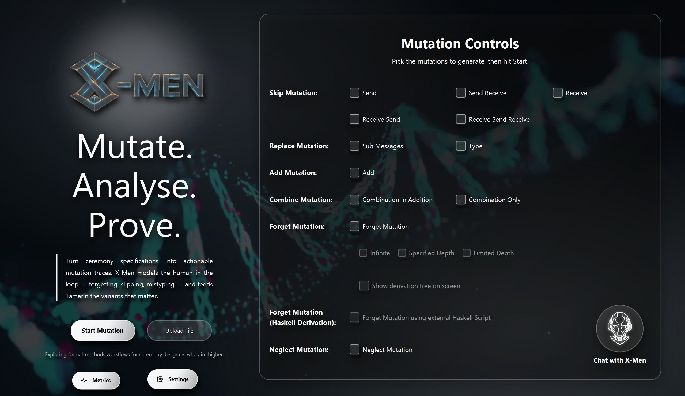

<div align="center">


# X-Men

### A Mutation-Based Approach for the Formal Analysis of Security Ceremonies

<p>
  
  
  
  
  
  
</p>

<sub><em>Formal modelling • Human-error mutations • Tamarin-compatible output</em></sub>

</div>

---

## ✨ Table of Contents

- [About The Project](#-about-the-project)
- [Built With](#-built-with)
- [Architecture at a Glance](#-architecture-at-a-glance)
- [Getting Started](#-getting-started)
  - [Installing Java and Maven](#installing-java-and-maven)
  - [Setting Up Path Variables](#setting-up-path-variables)
  - [Installing Git](#installing-git)
  - [Cloning the Project](#cloning-the-project)
  - [Installing IntelliJ IDEA](#installing-intellij-idea)
  - [Building and Running the Project](#building-and-running-the-project)
  - [Setting Up Postman](#setting-up-postman)
- [API Reference](#-api-reference)
  - [Browsing the API with Swagger UI](#browsing-the-api-with-swagger-ui)
  - [Health checks](#health-checks)
  - [Individual mutation endpoints](#individual-mutation-endpoints)
  - [Combined mutation endpoint](#combined-mutation-endpoint)
- [Docker](#-docker)
  - [Build & run the image](#build--run-the-image)
  - [Docker Compose](#docker-compose)
  - [Environment overrides](#environment-overrides)
- [Settings, Vocabulary & Themes](#-settings-vocabulary--themes)
- [Configuration](#-configuration)
- [Haskell Derivation Service](#-haskell-derivation-service)
- [Project Structure](#-project-structure)
- [Troubleshooting](#-troubleshooting)
- [Test Coverage with JaCoCo](#-test-coverage-with-jacoco)

---

## 📖 About The Project

> *Security ceremonies extend cryptographic protocols by explicitly including
> the human user. They may therefore suffer from vulnerabilities that arise
> from unexpected or incorrect human behaviour, even when the underlying
> cryptography is sound.*

**X-Men** automates the analysis of such ceremonies by **mutating** them
according to a formal catalogue of human-induced deviations and feeding the
mutated models to [Tamarin](https://tamarin-prover.github.io/) for
verification. The current toolchain implements the following mutations:

| Mutation | Captured behaviour |
| --- | --- |
| **Skip** | User omits a send / receive / internal action. |
| **Add** | User performs an extra, unforeseen action. |
| **Replace** | User substitutes a sent message with a different but type-compatible one. |
| **Neglect** | User skips an internal check (e.g. failing to verify a nonce). |
| **Disorder** | User reorders actions. |
| **Forget** | User loses access to a remembered piece of information (e.g. a password). |

The **Forget** mutation — the most recent addition — is the focus of the
companion research paper and is the engine behind X-Men's flagship case study,
the **Bank Login ceremony**. It models the eminently human behaviour of
forgetting a credential and substituting a similar one from memory.

<details>
<summary><strong>Why does this matter?</strong></summary>

<br/>

Standard protocol analysis assumes the human acts according to specification.
Real users do not. X-Men closes that gap by generating *executable* mutated
models that Tamarin can analyse end-to-end, surfacing attacks that depend on
human mistakes rather than cryptographic weaknesses.

</details>

---

## 🛠 Built With

| Layer | Technology |
| --- | --- |
| Language | [**Java 21**](https://www.oracle.com/java/technologies/javase/jdk21-archive-downloads.html) |
| Build | [**Apache Maven 3.9**](https://maven.apache.org/) (via `mvnw` wrapper) |
| Framework | [**Spring Boot 3**](https://spring.io/projects/spring-boot) |
| API docs | [**springdoc-openapi** / Swagger UI](https://springdoc.org/) |
| Native UI | **JavaFX** (in-process) |
| Verifier (downstream) | [**Tamarin Prover**](https://tamarin-prover.github.io/) |
| Optional analytics | [**Haskell Derivation Service**](./HASKELL_DERIVATION_SERVICE.md) |
| Container | **Docker** (multi-stage, JRE 21 slim runtime) |

---

## 🧭 Architecture at a Glance

```
              ┌─────────────────────────────────────────────────────┐
              │                  X-Men (Spring Boot)                │
              │                                                     │
   .spthy ──► │  Parser ─► Mutation Engine ─► .m generator ──► .zip │ ──► Tamarin
              │            │                                        │
              │            └─► HybridDerivationService              │
              │                    │                                │
              │                    ├─ Java DY engine (default)      │
              │                    └─ Haskell service (opt-in)──────┼─► POST /derive
              └─────────────────────────────────────────────────────┘
```

- **Input:** a Tamarin `.spthy` ceremony specification.
- **Output:** a `.zip` of mutated `.m` files, one per mutation variant.
- **Modes of access:** Native JavaFX UI, REST API, Postman collection, or
  Swagger UI.

---

## 🚀 Getting Started

The shortest path from a clean machine to a running X-Men instance.

### Installing Java and Maven

1. **Java 21** — download from
   [Oracle](https://www.oracle.com/java/technologies/javase/jdk21-archive-downloads.html)
   or [Adoptium Temurin](https://adoptium.net/) and run the platform installer.
2. **Maven 3.9+** — download the binary archive from the
   [Apache Maven site](https://maven.apache.org/download.cgi) and unpack it to
   a stable location (e.g. `C:\Program Files\Apache\maven`).

> 💡 The repository ships with the Maven Wrapper (`mvnw`, `mvnw.cmd`), so a
> system-wide Maven install is **optional** — you can use `./mvnw …` instead.

---

### Setting Up Path Variables

<details>
<summary><strong>🪟 Windows</strong></summary>

<br/>

1. Press <kbd>Win</kbd> + <kbd>R</kbd>, type `sysdm.cpl`, press <kbd>Enter</kbd>.
2. Switch to **Advanced ▸ Environment Variables…**
3. Under **System variables**, click **New…** and add:
   - `JAVA_HOME` → `C:\Program Files\Java\jdk-21`
   - `MAVEN_HOME` → `C:\Program Files\Apache\maven`
4. Edit **Path** and append:
   - `%JAVA_HOME%\bin`
   - `%MAVEN_HOME%\bin`
5. Open a **new** terminal — old shells won't see the change.

</details>

<details>
<summary><strong>🍎 macOS</strong> / <strong>🐧 Linux</strong></summary>

<br/>

Append to `~/.zshrc` (or `~/.bashrc`):

```bash
export JAVA_HOME=$(/usr/libexec/java_home -v 21)   # macOS
# export JAVA_HOME=/usr/lib/jvm/temurin-21-jdk    # Linux
export MAVEN_HOME=/opt/apache-maven
export PATH="$JAVA_HOME/bin:$MAVEN_HOME/bin:$PATH"
```

Reload:

```bash
source ~/.zshrc
```

</details>

#### Verify the install

```bash
java -version
mvn  -version
```

You should see Java 21.x and Maven 3.9.x respectively.

---

### Installing Git

| Platform | Command |
| --- | --- |
| **Windows** | Download from [git-scm.com](https://git-scm.com/) and run the installer. Choose **Git Bash** as the default terminal. |
| **macOS**   | `brew install git` |
| **Linux**   | `sudo apt install git`  (Debian/Ubuntu) — `sudo dnf install git` (Fedora) |

Verify:

```bash
git --version
```

---

### Cloning the Project

```bash
git clone <repository-url>
cd X-Men_2.0
```

> Paths containing apostrophes (e.g. `a folder named O'Reilly`) are supported
> on Windows — `mvnw.cmd` already escapes them before invoking PowerShell.

---

### Installing IntelliJ IDEA

1. Download **IntelliJ IDEA Community Edition** from
   [JetBrains](https://www.jetbrains.com/idea/download/).
2. Install for your OS.
3. Launch IntelliJ ▸ **Open…** ▸ select the cloned `X-Men_2.0` folder.
4. IntelliJ auto-detects `pom.xml`. If it doesn't, right-click `pom.xml` ▸
   **Add as Maven Project**.

---

### Building and Running the Project

#### 1) Build

From the project root:

```bash
# Using the wrapper (recommended — works without a system Maven)
./mvnw clean install        # macOS / Linux
mvnw.cmd clean install      # Windows

# Or your system Maven
mvn clean install
```

#### 2) Run — the Spring Boot app (REST API)

```bash
./mvnw spring-boot:run
```

The server comes up on **`http://localhost:8081`**.

#### 3) Run — with the Native JavaFX UI

In IntelliJ:

1. **Run ▸ Edit Configurations…**
2. **+** ▸ **Application** ▸ Main class `com.xmen.Application`.
3. **Modify options ▸ Add VM options:** `-Djava.awt.headless=false`.
4. **Environment variables (optional):** `JAVA_OPTS=-Djava.awt.headless=false`.
5. **Apply**, then **Run ▶**.

The Native UI looks like this:

<p align="center">
  
</p>

From the UI:

1. Tick the checkboxes for the mutations you want generated.
2. Upload a `.spthy` file.
3. Click **Start Mutation** — a `.zip` containing all mutated `.m` files is
   produced in the working directory.


---

### Setting Up Postman

1. Install [Postman](https://www.postman.com/downloads/).
2. **File ▸ Import** ▸ select
   `src/main/resources/X-Men.postman_collection.json`.
3. The full **X-Men** collection appears in the sidebar with one folder per
   mutation type.
4. With the Spring Boot app running, pick a request (e.g. *Forget Mutation*),
   attach a `.spthy` file under `form-data ▸ file`, and **Send**.

> Tip: each request stores the response as `application/octet-stream`.
> Use **Save response ▸ Save to a file** to grab the `.zip`.

---

## 📡 API Reference

All endpoints listen on `http://localhost:8081` by default and accept a
single `.spthy` upload as `form-data` under the key `file`. Responses are
streamed `.zip` archives containing the mutated `.m` files.

### Browsing the API with Swagger UI

X-Men ships with **[springdoc-openapi](https://springdoc.org/)**, which means
the moment the Spring Boot app is running you get a **live, interactive API
explorer** in your browser — no extra setup, no extra dependencies, and no
need to write or import a Postman collection just to poke at an endpoint.

#### 🌐 Where to go

| Asset | URL | Use it for |
| --- | --- | --- |
| 🧭 **Swagger UI** | <http://localhost:8081/swagger-ui/index.html> | Human-friendly playground — browse, expand, upload `.spthy`, hit **Try it out**. |
| 📜 **OpenAPI JSON** | <http://localhost:8081/v3/api-docs> | Machine-readable spec — feed into Postman, Insomnia, Bruno, or a client generator. |
| 📜 **OpenAPI YAML** | <http://localhost:8081/v3/api-docs.yaml> | Same spec, friendlier diffing in PRs. |

#### 🏷️ How the API is organised

The endpoints are grouped under tags so you can navigate large mutation
catalogues quickly. The left rail of Swagger UI lists them in this order:

| Tag | What lives here |
| --- | --- |
| **Mutations** | The combined `/api/generateMutations` endpoint controlled by request headers. |
| **Add Mutations** | The dedicated *Add* mutation endpoint. |
| **Forget Mutations** | All *Forget* endpoints, including the Haskell-activated variant. |
| **Neglect Mutations** | The dedicated *Neglect* mutation endpoint. |
| **Replace Mutations** | *Replace Sub-messages* and *Replace Type* endpoints. |
| **Skip Mutations** | *Skip Send / Receive / Send→Receive / Receive→Send / Receive→Send→Receive*. |
| **Derivation** | Haskell-backed derivation analysis (`/api/derive`, `/api/derive/health`). |

#### ▶️ Running a request from the browser — 60-second tour

1. Make sure the app is up: `./mvnw spring-boot:run` (or `docker compose up`).
2. Open <http://localhost:8081/swagger-ui/index.html>.
3. Expand the tag you care about (e.g. **Forget Mutations**) and click a
   `POST` row to reveal the request panel.
4. Hit **Try it out** — every input becomes editable.
5. For mutation endpoints:
   - **Body** → `file` field → click **Choose File** → pick your `.spthy`.
   - **Headers** → flip the boolean toggles or paste values
     (`Haskell-Activate: true`, `Blocking-Mode: CASE1`, …).
6. Click **Execute**. You'll get:
   - The **HTTP status** and timing in the response section.
   - A **Download file** button for the streamed `.zip` of mutated `.m` files.
   - A ready-to-paste **`curl`** invocation in the *Curl* block — perfect for
     scripting the same call later.

#### 🧪 Worked example — Forget mutation with the Haskell engine

In Swagger UI:

> **Forget Mutations ▸ `POST /api/forget/mutations`** ▸ *Try it out* ▸
> upload `Bank_revised_new.spthy` ▸ set header
> `Haskell-Activate: true` ▸ **Execute**

The *Curl* block will display the equivalent shell call, e.g.

```bash
curl -X POST "http://localhost:8081/api/forget/mutations" \
  -H "Haskell-Activate: true" \
  -F "file=@Bank_revised_new.spthy" \
  -o forget_mutations.zip
```

…which you can copy verbatim into a terminal or CI pipeline.


### Health checks

| Method | Path | Purpose |
| --- | --- | --- |
| `GET`  | `/actuator/health/` | Liveness / readiness probe (Spring Boot Actuator). |

### Individual mutation endpoints

Each one performs a single mutation pattern and returns a `.zip` of mutated
`.m` files.

| Method | Endpoint | Mutation |
| --- | --- | --- |
| `POST` | `/api/skip/sendMutations` | Skip Send |
| `POST` | `/api/skip/receiveMutations` | Skip Receive |
| `POST` | `/api/skip/sendReceiveMutations` | Skip Send→Receive chain |
| `POST` | `/api/skip/receiveSendMutations` | Skip Receive→Send chain |
| `POST` | `/api/skip/receiveSendReceive` | Skip Receive→Send→Receive chain |
| `POST` | `/api/addMutations` | Add Mutation |
| `POST` | `/api/replace/subMessagesMutations` | Replace Sub-messages |
| `POST` | `/api/replace/typeMutations` | Replace Type |
| `POST` | `/api/neglect/mutations` | Neglect Mutation |
| `POST` | `/api/forget/mutations` | Forget Mutation |

Example:

```bash
curl -X POST "http://localhost:8081/api/forget/mutations" \
  -F "file=@Bank_revised_new.spthy" \
  -o forget_mutations.zip
```

### Combined mutation endpoint

`POST /api/generateMutations` runs **any combination** of the above mutations
in a single call. Selection is via boolean headers:

| Header | Effect |
| --- | --- |
| `Skip-Send: true` | Enable Skip Send |
| `Skip-Receive: true` | Enable Skip Receive |
| `Skip-Send-Receive: true` | Enable Skip Send Receive |
| `Skip-Receive-Send: true` | Enable Skip Receive Send |
| `Skip-Receive-Send-Receive: true` | Enable longer skip chains |
| `Add-Mutation: true` | Enable Add |
| `Replace-Sub-Messages: true` | Enable Replace Sub-messages |
| `Replace-Type: true` | Enable Replace Type |
| `Neglect-Mutation: true` | Enable Neglect |
| `Forget-Mutation: true` | Enable Forget |
| `True-Replace: true` | Knowledge-based (rather than random) replacements |
| `Haskell-Activate: true` | Route Forget derivability to the external Haskell service |

Example — Forget mutation with the Haskell engine:

```bash
curl -X POST "http://localhost:8081/api/generateMutations" \
  -H "Forget-Mutation: true" \
  -H "Haskell-Activate: true" \
  -F "file=@CoachService.spthy" \
  -o mutants_forget_haskell.zip
```

> 📚 For everything to do with the optional Haskell engine — installation,
> wire-up, examples, troubleshooting — see
> **[`HASKELL_DERIVATION_SERVICE.md`](./HASKELL_DERIVATION_SERVICE.md)**.

---

## 🐳 Docker

<table>
<tr>
<td>

> **Docker is for API testing and service-mode runs only.**  
> X-Men's primary interface is a native JavaFX desktop application. Docker
> Desktop cannot open that JavaFX UI as a normal Windows/macOS/Linux desktop
> window from inside a Linux container. Use Docker when you want a reproducible
> Spring Boot API runtime for Swagger, Postman, curl, or integration testing.
> Use the local Java/Maven launch path in [Getting Started](#-getting-started)
> when you need the full native desktop application.

</td>
</tr>
</table>

X-Men ships with a production-grade **multi-stage `Dockerfile`**:

- **Stage 1** uses `maven:3.9.9-eclipse-temurin-21` to compile and package.
- **Stage 2** runs the resulting jar on a slim `eclipse-temurin:21-jre` image
  as a **non-root** API/service process, with a built-in `HEALTHCHECK`.

A `.dockerignore` keeps the build context tight (no `target/`, no IDE files,
no docs) so image builds are fast and reproducible.

### Build & run the image

```bash
# Build
docker build -t x-men:latest .

# Run
docker run --rm -p 8081:8081 --name x-men x-men:latest

# Or in the background
docker run -d -p 8081:8081 --name x-men x-men:latest

# Verify
curl http://localhost:8081/actuator/health/
```

Once the container is running, API documentation is available at:

```text
http://localhost:8081/swagger-ui/index.html
```

### Docker Compose

A reference `docker-compose.yml` is included. It runs the X-Men Spring Boot API
service by itself, and — under the optional `haskell` profile — also brings up
the Haskell derivation service on `9091`, wired together over Compose's default
network.

```bash
# X-Men only
docker compose up --build

# X-Men + Haskell Derivation Service
docker compose --profile haskell up --build

# Tear everything down
docker compose down
```

### Environment overrides

| Variable | Default | Description |
| --- | --- | --- |
| `SERVER_PORT` | `8081` | HTTP port the app binds to. |
| `APP_NAME` | `X-Men` | Application display name. |
| `APP_CORS_ALLOWED_ORIGINS` | `http://localhost:8081,…,http://localhost:5173` | Allowed CORS origins (comma-separated). |
| `DERIVATION_SERVICE_URL` | `http://localhost:9091` | Endpoint of the Haskell service. |
| `JAVA_OPTS` | `-Djava.awt.headless=false` | Extra JVM flags. |
| `XMEN_UI_ENABLED` | `false` in Docker, `true` locally | Controls whether the JavaFX desktop UI is launched. Docker uses service mode; local desktop runs keep the UI enabled. |
| `SPRING_PROFILES_ACTIVE` | `default` | Spring profile selector. |

Pass them at run-time like:

```bash
docker run --rm -p 9090:9090 \
  -e SERVER_PORT=9090 \
  -e DERIVATION_SERVICE_URL=http://host.docker.internal:9091 \
  x-men:latest
```

---

## 🎨 Settings, Vocabulary & Themes

X-Men ships with a runtime-mutable settings layer so the same tool can be re-targeted at
different naming conventions and re-skinned with a new colour palette **without changing
any code**.

### 🗣️ Vocabulary (Level 1 generalisation)

Every "hardcoded" word like `Send`, `Receive`, `Forget`, `State`, `Out`, `In` lives in
[`src/main/resources/vocabulary.yaml`](src/main/resources/vocabulary.yaml). The Forget
mutation reads its non-internal action set from there, and the file binds to a Spring
`@ConfigurationProperties` bean (`CeremonyVocabulary`) that the Settings API can mutate at
runtime.

| Endpoint | What it does |
| --- | --- |
| `GET /api/settings/vocabulary` | Read the live vocabulary. |
| `POST /api/settings/vocabulary` | Patch the live vocabulary (partial JSON allowed). |
| `POST /api/settings/vocabulary/reset` | Restore built-in defaults. |
| `GET /api/settings/vocabulary/export` | Download the active vocabulary as `vocabulary.yaml`. |
| `POST /api/settings/vocabulary/import` | Upload a YAML file (`multipart/form-data` field `file`). |

### 🎨 Themes (28 built-in palettes)

[`src/main/resources/themes.yaml`](src/main/resources/themes.yaml) ships twenty-eight named
themes — Classic (default), Garden Mint, Midnight Violet, Ocean Cobalt, Sunset
Coral, Amber Grove, Rose Quartz, Forest Emerald, Cyber Teal, Solar Yellow, Indigo Night,
Lavender Mist, Charcoal Mono, Paper Light, Arctic Ice, Volcanic Red, Mocha Brown, Slate
Blue, Neon Pink, Sage Green, Copper Bronze, Crimson Wine, Powder Blue, Sandstone, Magenta
Storm, Pine Forest, Royal Purple, Tangerine. Each tile in the Settings dialog renders the
theme's name beneath a small classy preview card.

Each theme controls the accent colour, glass-panel shade, overlay tone, and text colour
all at once. Switching a theme is a single HTTP call:

```bash
curl -X POST http://localhost:8081/api/settings/themes/active \
  -H "Content-Type: application/json" \
  -d '{"id":"midnight-violet"}'
```

| Endpoint | What it does |
| --- | --- |
| `GET /api/settings/themes` | List all 28 themes + the active id. |
| `GET /api/settings/themes/active` | Resolve the active theme. |
| `POST /api/settings/themes/active` | Switch the active theme by id. |
| `GET /api/settings/themes/{id}` | Look up one theme. |

### ✅ Pre-flight Tamarin syntax validation

Upload a `.spthy` file to the validator before kicking off a mutation run. The validator
performs a structural check (mandatory `theory … begin … end` envelope, balanced
delimiters) followed by the full ANTLR parse. Errors come back with line and column
numbers in a JSON body.

```bash
curl -X POST http://localhost:8081/api/settings/validate \
  -F "file=@Bank_revised_new.spthy"
```

### 🖥️ Native UI

The JavaFX UI exposes all of the above through a redesigned hero scene (glass panels +
gradient CTAs + pill nav) plus a dedicated **Settings** dialog (gear icon, bottom-left).
The dialog has three tabs:

| Tab | Contents |
| --- | --- |
| **Vocabulary** | Editable table of every key/value, with **Detect · Reset · Export YAML · Import YAML**. Importing a YAML prompts you to save it as a named profile. Profile dropdown · **Load** · **Delete**. |
| **Themes** | The 28 palette tiles — preview + name under each. Clicking one re-tints the whole UI instantly. |
| **Preferences** | UI toggles — validate on upload, animations, derivation overlay. |

Behavioural notes that ship with the redesigned UI:

- **Multi-monitor aware** — the app sizes itself to whichever monitor it is launched on; popups, toasts, settings, and chat panels all stay on that monitor.
- **Dark window chrome** — the OS title bar is requested in dark mode on Windows, macOS, and (best-effort) Linux so it matches the active theme.
- **Themed popups** — Success, Error, and Confirm dialogs render as themed cards with no white wrapper. Non-confirm popups auto-dismiss after 5 seconds.
- **Forget mutation defaults** — selecting Forget enables **Infinite** by default; the radio order is Infinite · Specified Depth · Limited Depth.
- **Download after success** — once a mutation run completes, a Download button appears next to Start Mutation (and inside the derivation-tree panel) so the generated zip can be saved anywhere.
- **Chat with X-Men** — bot answers render with markdown-lite bullets/bold; conversations can be deleted from the sidebar. The bot knows about every mutation, depth modes, derivation trees, vocabularies, themes, the Tamarin/Dolev–Yao backdrop, and how to drive the UI.

### Snapshot in one call

Need every setting at once (for a new UI client)?

```bash
curl http://localhost:8081/api/settings
```

Returns `{ "vocabulary": …, "themes": { "active": …, "catalog": [...] } }` in a single
request.

---

## ⚙️ Configuration

Application defaults live in `src/main/resources/application.yaml` and read
from environment variables with sensible fallbacks. The most common knobs are
documented in
**[`ENVIRONMENT_CONFIG.md`](./ENVIRONMENT_CONFIG.md)** — including the local
`.env` workflow for development.

---

## 🧪 Haskell Derivation Service

The optional Haskell microservice is a self-contained topic with its own
configuration, request format, and operational notes. Everything lives in:

➡️ **[`HASKELL_DERIVATION_SERVICE.md`](./HASKELL_DERIVATION_SERVICE.md)**

That document covers: when you need the service, how to start it, the exact
conversion pipeline, environment overrides, networking from Docker / Compose,
the failure-handling contract, and a focused troubleshooting table.

---

## 🗂 Project Structure

```
X-Men_2.0/
├── src/
│   ├── main/
│   │   ├── java/com/xmen/
│   │   │   ├── controller/        # REST controllers
│   │   │   ├── service/           # Mutation engines, derivation services
│   │   │   │   ├── forget/        # Forget mutation helpers
│   │   │   │   ├── derivation/    # DY derivation utilities
│   │   │   │   └── impl/          # Concrete mutation strategies
│   │   │   ├── model/             # Parsed Tamarin AST + DTOs
│   │   │   ├── utilities/         # File I/O, Setup extractor, etc.
│   │   │   └── user_interface/    # JavaFX views
│   │   └── resources/
│   │       ├── application.yaml
│   │       ├── images/            # UI artwork (used by README too)
│   │       └── X-Men.postman_collection.json
│   └── test/                      # Unit / integration tests
├── Dockerfile
├── docker-compose.yml
├── .dockerignore
├── mvnw, mvnw.cmd                 # Maven Wrapper
├── pom.xml
├── ENVIRONMENT_CONFIG.md          # Environment-variable reference
├── HASKELL_DERIVATION_SERVICE.md  # Sub-README for the Haskell integration
└── README.md                      # ← you are here
```

---

## 🧯 Troubleshooting

| Symptom | Likely cause | Fix |
| --- | --- | --- |
| `mvnw.cmd` errors on Windows: *"Unexpected token 's' in expression or statement."* | Project path contains an apostrophe. | Already patched — `mvnw.cmd` escapes `'` before calling PowerShell. If you re-ran `mvn -N wrapper:wrapper`, re-apply the patch. |
| Native UI doesn't open. | Headless mode left on. | Add VM option `-Djava.awt.headless=false` to the run configuration. |
| `Forget` mutation produces no changes. | The `.spthy` rule has no `Forget(...)` action. | Add an explicit `Forget(<term>)` annotation to the rule of interest. |
| `Haskell-Activate: true` has no effect. | External Haskell service not reachable. | See [`HASKELL_DERIVATION_SERVICE.md`](./HASKELL_DERIVATION_SERVICE.md#9-troubleshooting). |
| CORS blocked from a custom frontend. | Origin not whitelisted. | Set `APP_CORS_ALLOWED_ORIGINS` to include your origin. |
| Docker build slow on subsequent rebuilds. | Layer cache invalidated by source edits. | Edits under `src/` only invalidate Stage 1's source layer — dependency resolution stays cached. |

---

## 📊 Test Coverage with JaCoCo

The build is wired up with the [**JaCoCo**](https://www.jacoco.org/jacoco/) Maven
plugin so that every `mvn test` (or `mvn verify` / `mvn install`) run produces a
full code-coverage report alongside the usual Surefire test results.

### Run the tests and generate the report

```bash
# Using the wrapper
./mvnw clean test            # macOS / Linux
mvnw.cmd clean test          # Windows

# Or your system Maven
mvn clean test
```

### Where to find the results

| Artifact | Path | Use it for |
| --- | --- | --- |
| 🧪 **Surefire test results** | `target/surefire-reports/` | JUnit XML + plain-text per-test reports. |
| 📈 **JaCoCo HTML report** | `target/site/jacoco/index.html` | Open in any browser to drill into per-package / per-class line & branch coverage. |
| 📄 **JaCoCo XML report** | `target/site/jacoco/jacoco.xml` | Machine-readable feed for CI dashboards (Codecov, SonarQube, etc.). |
| 🧷 **Raw execution data** | `target/jacoco.exec` | Binary coverage data the report goal consumes. |

> 💡 Model classes (`com.xmen.model.*`) are intentionally excluded from the
> coverage figures because they are mostly generated parsers and DTOs.
